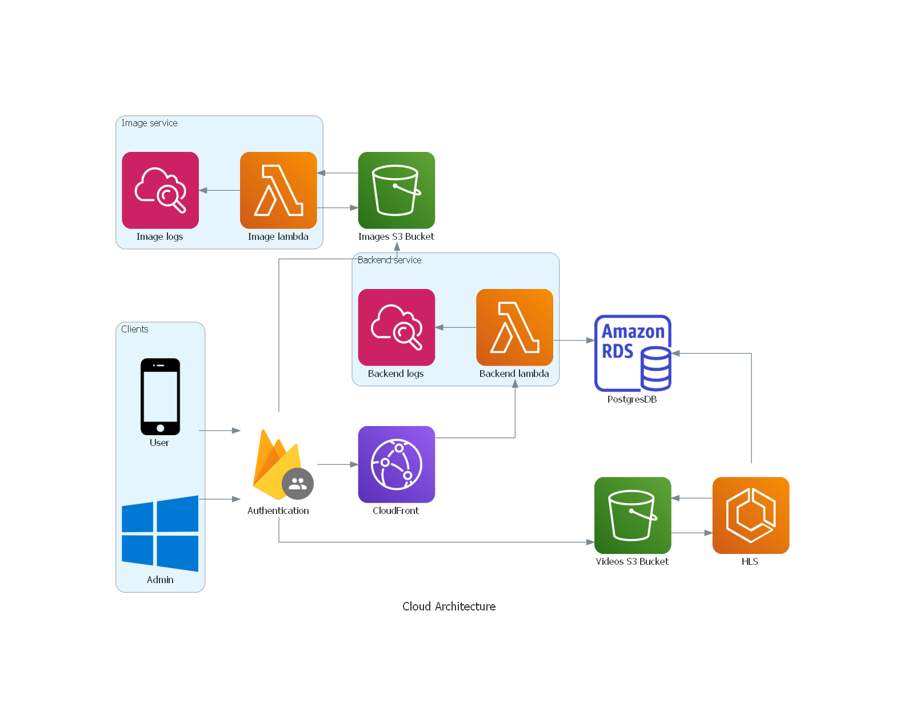

# PrepaSn

## Cloud Architecture

This project was generated using [Nx](https://nx.dev).

## Adding capabilities to your workspace

Nx supports many plugins which add capabilities for developing different types of applications and different tools.

These capabilities include generating applications, libraries, etc as well as the devtools to test, and build projects as well.

Below are our core plugins:

- [React](https://reactjs.org)
  - `npm install --save-dev @nrwl/react`
- [Nest](https://nestjs.com)
  - `npm install --save-dev @nrwl/nest`

There are also many [community plugins](https://nx.dev/community) you could add.

## Development server

Run `nx serve my-app` for a dev server. The app will automatically reload if you change any of the source files.

## Build

Run `nx build my-app` to build the project. The build artifacts will be stored in the `dist/` directory. Use the `--prod` flag for a production build.

## Running unit tests

Run `nx test my-app` to execute the unit tests via [Jest](https://jestjs.io).

Run `nx affected:test` to execute the unit tests affected by a change.

## Understand your workspace

Run `nx graph` to see a diagram of the dependencies of your projects.
